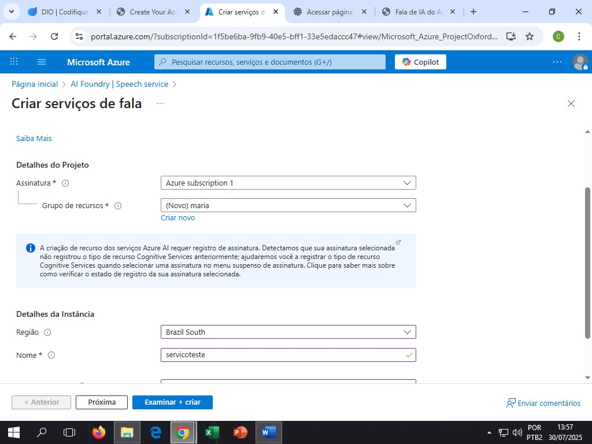
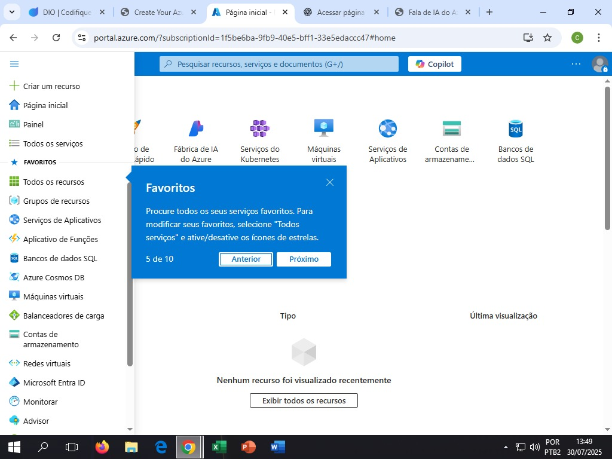
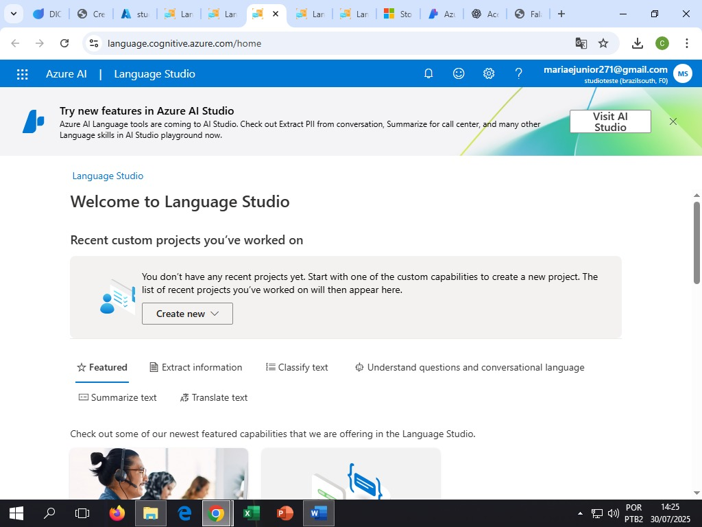
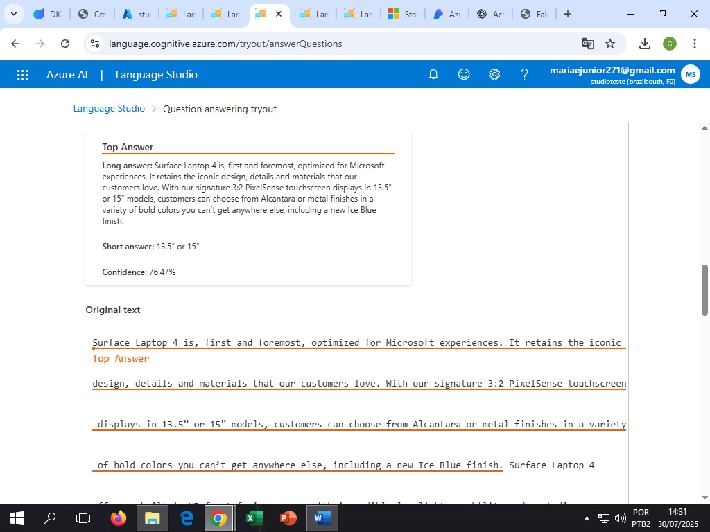
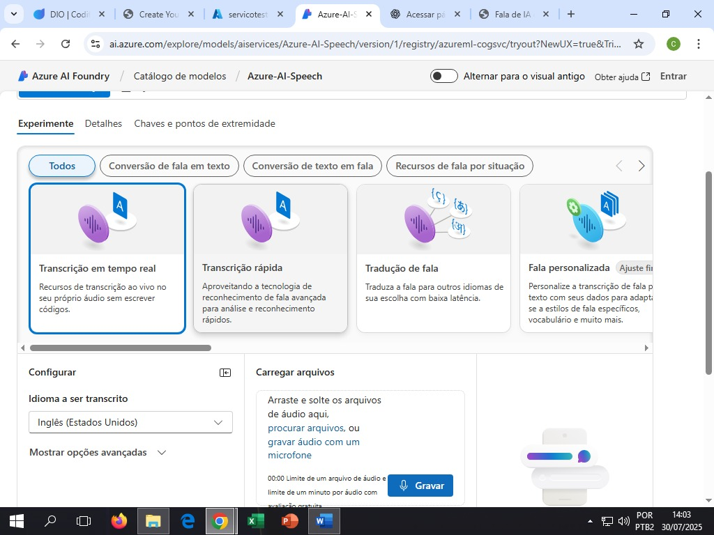
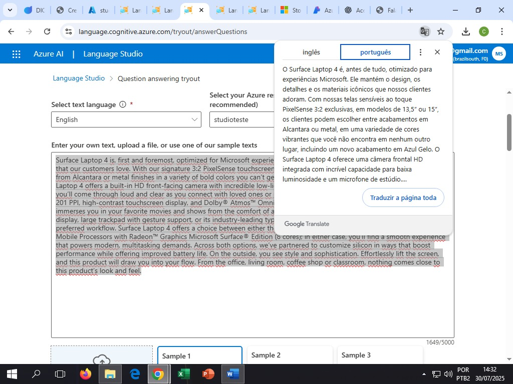
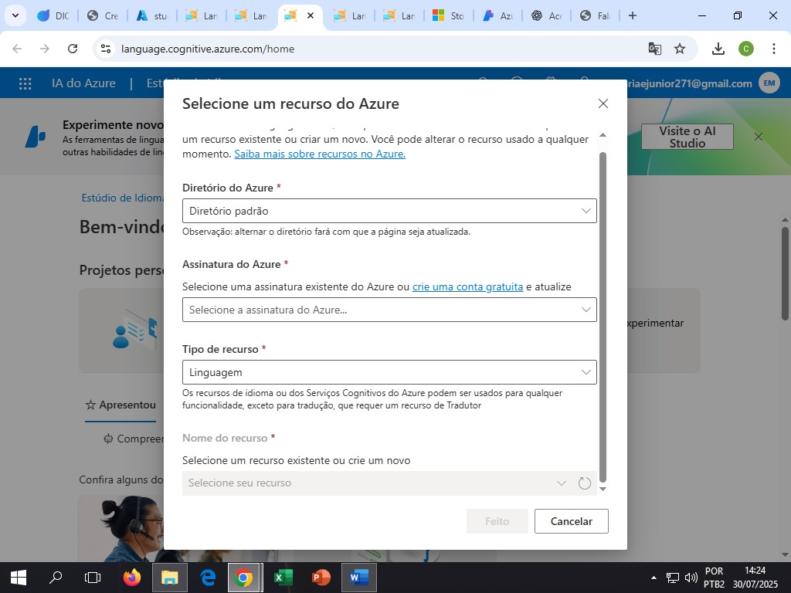
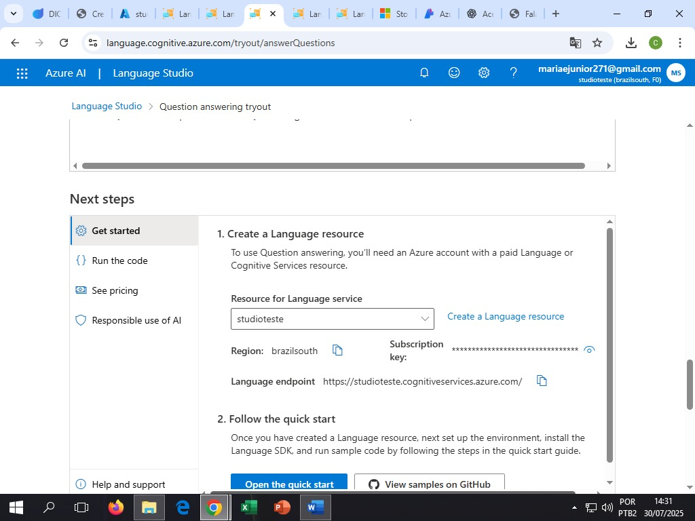

# Projeto: Análise de Fala e Linguagem com Azure

## 🎯 Objetivo

Este repositório foi criado como parte do laboratório prático para aprofundar o uso das ferramentas **Azure Speech Studio** e **Language Studio**, com foco na análise de fala e linguagem natural.

## 🧪 Ferramentas Utilizadas

- Azure Speech Studio
- Azure Language Studio

## 📝 Anotações e Insights

### Speech Studio:
- O reconhecimento de fala foi eficiente para áudios curtos.
- Apresentou limitações com sotaques regionais.
- A transcrição automática exige fala clara.
- Promove melhorias na comunicação digital

### Language Studio:
- A análise de sentimentos identificou corretamente emoções em frases simples.
- Pode ser usada para melhorar o atendimento ao cliente com bots.
- Pode influenciar nas decisões de compra
- Ajuda a mensurar com eficácia a atitude das pessoas em relação à uma organização
- A## 💡 Conclusão

As ferramentas da Azure mostraram-se úteis para soluções baseadas em IA voltadas para voz e linguagem. São recomendadas para projetos de atendimento, análise de texto e automação com linguagem natural.
  

## 📂 Organização
Durante a prática, compreendi melhor como essas ferramentas de IA podem ser aplicadas em contextos reais, como atendimento automatizado e análise de sentimentos.
## 🖼️ Capturas de Tela

A seguir, alguns prints da utilização das ferramentas:

